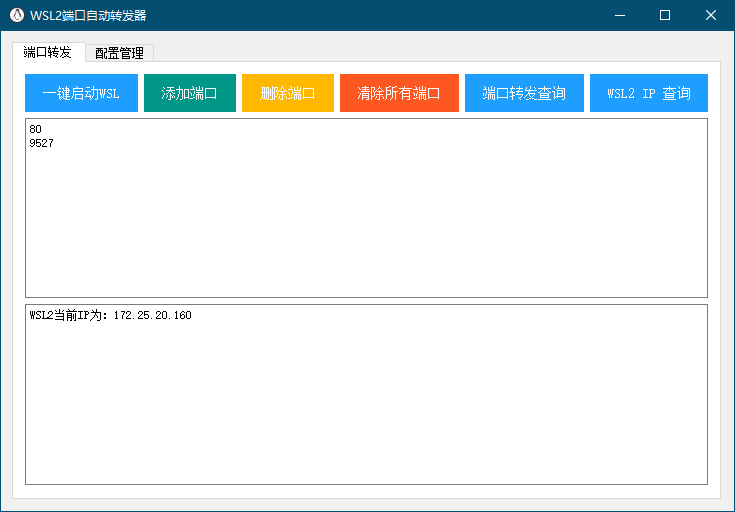
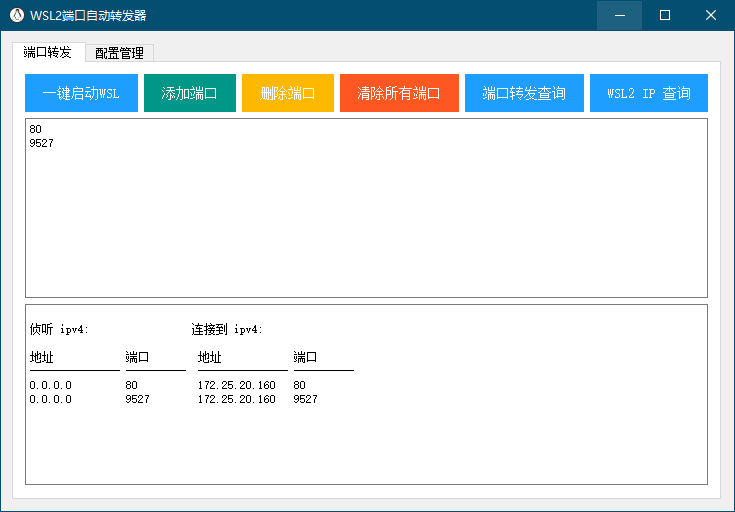

# WSL2端口自动转发工具

### 打包

```
pyinstaller wsl2.py -F --noconsole --hidden-import PySide2.QtXml --icon="lib/logo.ico" --add-data="lib\logo.ico;lib" --add-data="lib\wsl2.ui;lib" --add-data="lib\wsl.vbs;lib"
```

### 界面

+ 查询WSL2当前IP



+ 查询端口



+ 添加端口


+ 删除端口


+ 保存配置信息及启动脚本

