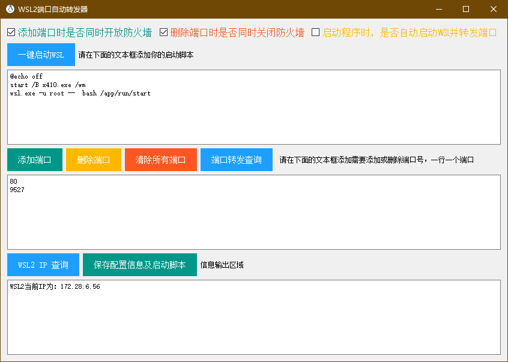
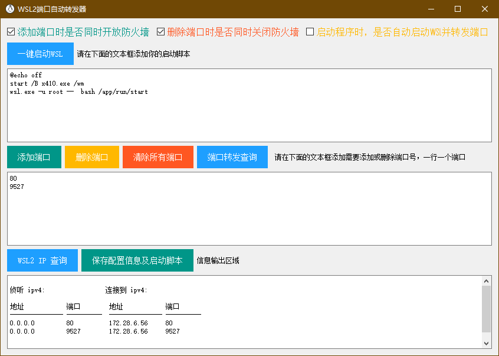
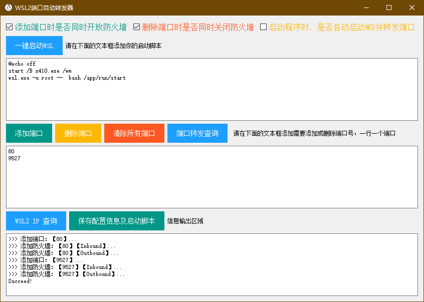
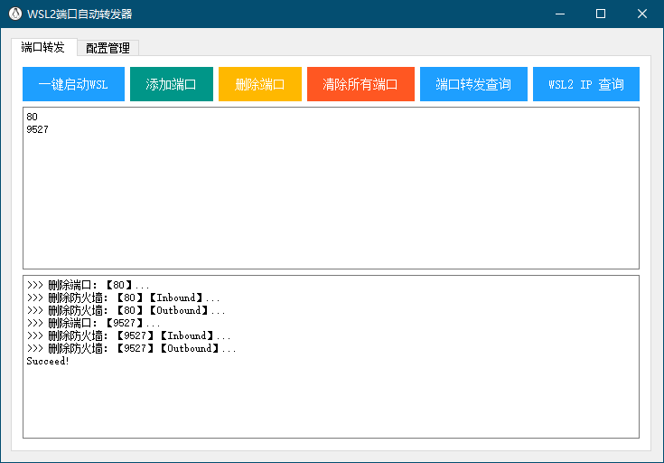
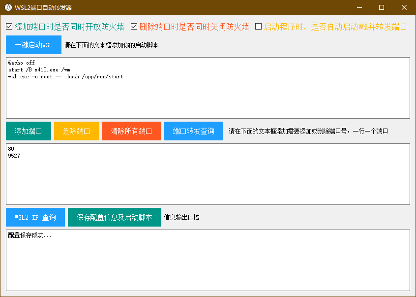

# WSL2端口自动转发工具

### 打包

```
pyinstaller WSL2AutoPortForward.py --noconsole --hidden-import PySide2.QtXml --icon="lib/logo.ico"
```

### 界面

+ 查询WSL2当前IP



+ 查询端口



+ 添加端口



+ 删除端口



+ 保存配置信息及启动脚本

